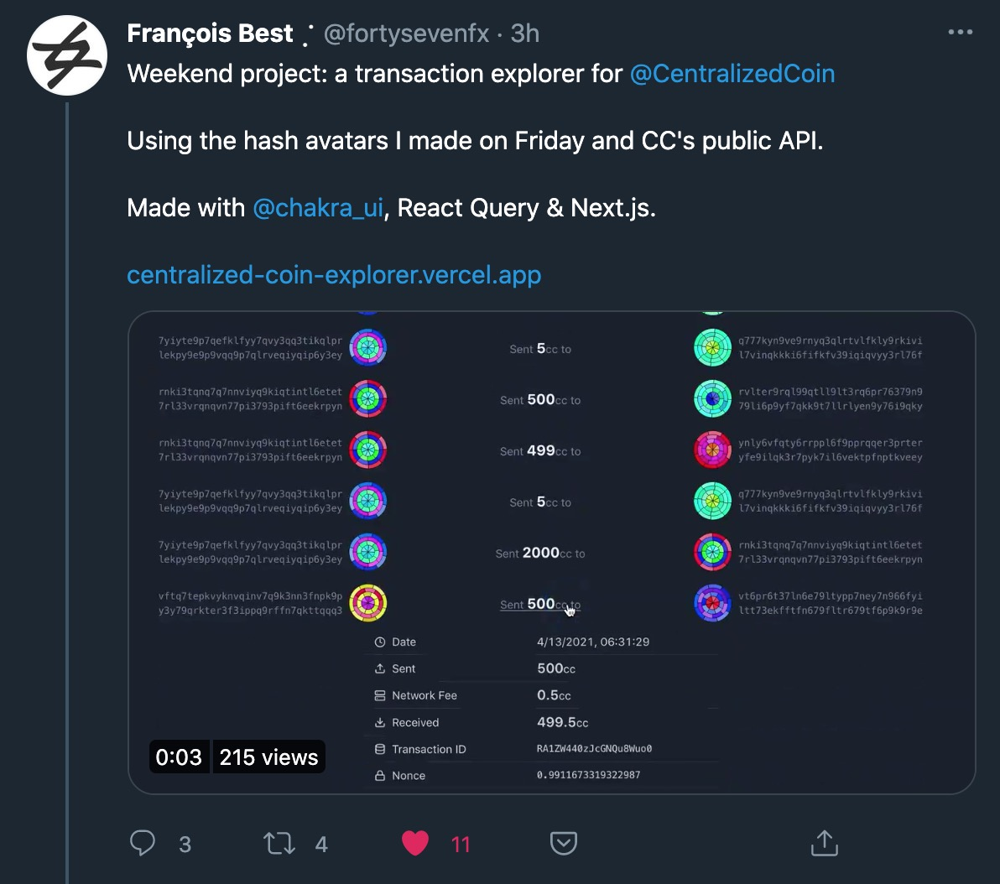

<p align="center">
    
</p>

# Hashvatar

Create hash avatar of your handler. Inspired from [this tweet](https://twitter.com/fortysevenfx/status/1383760179632566273?s=20):

<p align="center">
    
</p>

## Usage

Use this format in to get your hashvatar:

```
https://hashvatar.vercel.app/{yourhandler}
```

Example:

- [https://hashvatar.vercel.app/fortysevenfx](https://hashvatar.vercel.app/fortysevenfx)
  
- [https://hashvatar.vercel.app/wzulfikar](https://hashvatar.vercel.app/wzulfikar)
  

_That's it!_
